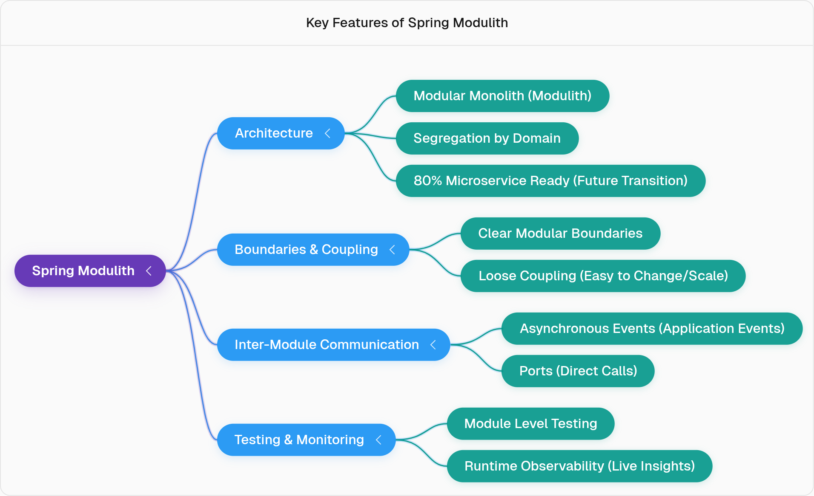

# 1. Understand aim of project

### project overview

## Spring Modulith Overview and Architecture 
**Traditional Monolithic** applications are easy to build initially, 
but they become tightly coupled and difficult to maintain, scale, or understand as the application grows.

**Microservices**  solve this by separating each domain into independent, decoupled services, 
but migrating a large monolithic application to microservices is complex and risky without fully understanding the existing system.

**Spring Modulith** offers a middle path, allowing developers to design a monolithic application in a modular way,
similar to microservices, without the complexity of a distributed system .
The term Modulith stands for Modular Monolith, meaning each domain is kept as an individual,
clean module within the single monolithic application .
Here is a mind map detailing the key architectural benefits of using Spring Modulith:

## Smart Parking System: Module Structure
* In a Modulith application, each feature is segregated into individual packages, which function as modules.
* For the Smart Parking System, the core features were segmented into the following modules: 
* **entry:** Handles all vehicle entry and exit related logic .
* **allocation:** Manages slot allocation, removal, and freeing up slots .
* **billing:** Handles all payment-related processing .
* **notification:** Manages sending notifications to the user .
Each module contains its own entities and repositories (e.g., entry has ParkingEntry entity, allocation has Slot entity) .

## Recommendation
1. Follow package-by-feature.
2. Make a class `public` only when it's necessary.

[Previous: Home](../README.md) &nbsp;&nbsp;&nbsp;&nbsp;
[Next: 2. Follow package-by-feature](step-1.md)
