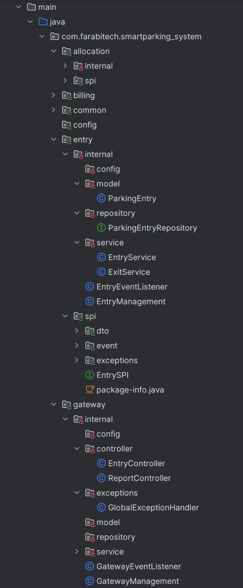
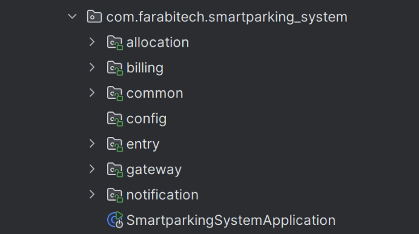

# 3. Add Spring Modulith support

## Add Spring Modulith dependencies

```xml
<properties>
    <spring-modulith.version>1.4.3</spring-modulith.version>
</properties>

<dependencyManagement>
    <dependencies>
        <dependency>
            <groupId>org.springframework.modulith</groupId>
            <artifactId>spring-modulith-bom</artifactId>
            <version>${spring-modulith.version}</version>
            <type>pom</type>
            <scope>import</scope>
        </dependency>
    </dependencies>
</dependencyManagement>

<dependencies>
    <!-- other dependencies -->
    <dependency>
        <groupId>org.springframework.modulith</groupId>
        <artifactId>spring-modulith-starter-core</artifactId>
    </dependency>
    
    <dependency>
        <groupId>org.springframework.modulith</groupId>
        <artifactId>spring-modulith-starter-test</artifactId>
        <scope>test</scope>
    </dependency>
</dependencies>
```

## IntelliJ IDEA Support for Spring Modulith
IntelliJ IDEA provides support for Spring Modulith. Check out the documentation [here](https://www.jetbrains.com/help/idea/spring-modulith.html).

**Module Indicators in the package structure:**



**Modules view in the Structure toolwindow:**



## Understand Spring Modulith concepts
* Top-level Modules
* Nested Modules
* Provided Interface (Expose Public API)
* Internal Implementation Components
* Required Interface (Dependencies on other Modules)
* ApplicationModules Types
  * Simple
  * Advanced
  * Open/Closed

## Create a ModularityTest class

```java
import ...

@SpringBootTest
class SmartparkingSystemApplicationTests {

    @Test
    void contextLoads() {
        ApplicationModules modules = ApplicationModules.of(SmartparkingSystemApplication.class)
                .verify();
        new Documenter(modules).writeDocumentation();

    }

}
```

Now run this test, and it will fail.

You can see all the violations of modular structure in the console output.

```shell
- Module 'allocation' depends on non-exposed type com.farabitech.smartparking_system.entry.internal.model within module 'entry'!

- Module 'billing' depends on non-exposed type com.farabitech.smartparking_system.notification.internal.service.NotificationService within module 'notification'!
...
...
```

## IntelliJ IDEA shows violations in the editor
```shell
 Note: The following sample is not related to the current project – it's just a simple sample.
```


We will fix these violations in the next steps.

[Previous: 2. Follow package-by-feature](step-2.md) &nbsp;&nbsp;&nbsp;&nbsp;
[Next: 4. Understand OPEN type modules](step-4.md)
